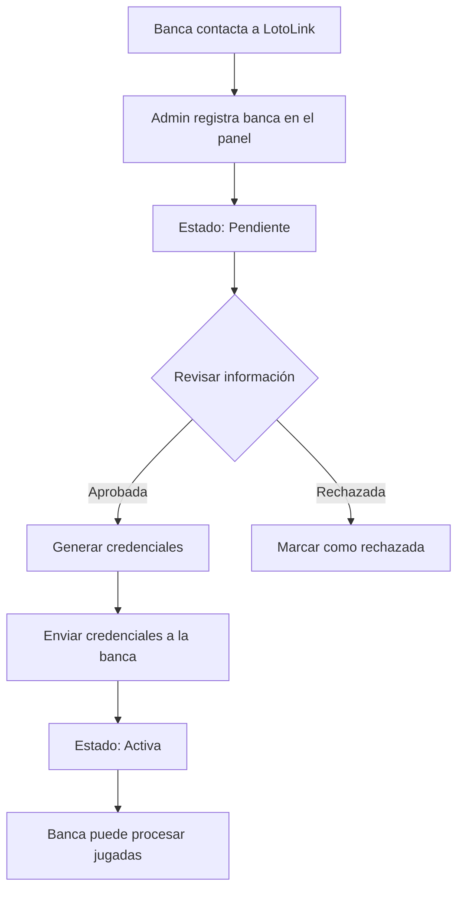

# Guía del Panel de Administración de Bancas

## Descripción General

El Panel de Administración de Bancas de LotoLink permite gestionar el registro, aprobación y administración de bancas que se integran con la plataforma. Este panel reemplaza el proceso manual anterior de registro por email/WhatsApp con un sistema automatizado y centralizado.

## Características Principales

### 1. **Registro de Nuevas Bancas**
- Formulario web para capturar información de la banca
- Validación automática de datos
- Estado inicial: "Pendiente" para todas las nuevas bancas

### 2. **Gestión de Solicitudes Pendientes**
- Vista de todas las bancas pendientes de aprobación
- Acciones: Aprobar o Rechazar
- Generación automática de credenciales al aprobar

### 3. **Administración de Bancas Activas**
- Lista completa de todas las bancas registradas
- Filtrado por estado (Pendiente, Aprobada, Activa, Suspendida, Rechazada)
- Acciones: Suspender o Activar bancas

### 4. **Estadísticas en Tiempo Real**
- Total de bancas registradas
- Bancas pendientes de aprobación
- Bancas activas
- Bancas suspendidas

## Acceso al Panel

### Requisitos Previos
1. Backend de LotoLink ejecutándose en `http://localhost:3000`
2. Base de datos PostgreSQL configurada y conectada
3. Navegador web moderno (Chrome, Firefox, Safari, Edge)

### Abrir el Panel
1. Abrir el archivo `admin-panel.html` en un navegador web
2. O acceder via servidor web (recomendado para producción)

## Uso del Panel

### Registrar una Nueva Banca

1. **Navegar a la pestaña "Registrar Nueva Banca"**
2. **Completar el formulario:**
   - **Nombre de la Banca*** (requerido): Nombre oficial de la banca
   - **Tipo de Integración*** (requerido):
     - `API Directa`: Para bancas con sistema propio que se conectarán via API
     - `App White-Label`: Para bancas que usarán la app POS de LotoLink
     - `Middleware`: Para integraciones personalizadas
   - **RNC / Identificación Fiscal**: Número de registro fiscal
   - **Dirección Física**: Dirección completa de la banca
   - **Teléfono de Contacto**: Número de teléfono principal
   - **Email del Administrador*** (requerido): Email para envío de credenciales
   - **Endpoint API** (opcional): URL del API de la banca (para integraciones directas)

3. **Hacer clic en "Registrar Banca"**
4. La banca quedará en estado "Pendiente" y aparecerá en la pestaña de solicitudes pendientes

### Aprobar una Banca

1. **Navegar a "Solicitudes Pendientes"**
2. **Revisar la información de la banca**
3. **Hacer clic en "✅ Aprobar"**
4. **Se generarán automáticamente las credenciales:**
   - Client ID
   - Client Secret
   - HMAC Secret
5. **Copiar las credenciales** (aparecerán en un modal)
6. **Enviar las credenciales a la banca** por email o método seguro
7. La banca pasará al estado "Activa"

⚠️ **IMPORTANTE**: Las credenciales se muestran solo una vez. Asegúrate de copiarlas y guardarlas de forma segura antes de cerrar el modal.

### Rechazar una Banca

1. **Navegar a "Solicitudes Pendientes"**
2. **Hacer clic en "❌ Rechazar"**
3. **Confirmar la acción**
4. La banca pasará al estado "Rechazada" y será marcada como inactiva

### Suspender una Banca Activa

1. **Navegar a "Todas las Bancas"**
2. **Localizar la banca activa**
3. **Hacer clic en "⏸️ Suspender"**
4. **Confirmar la acción**
5. La banca dejará de poder procesar jugadas hasta que se reactive

### Reactivar una Banca Suspendida

1. **Navegar a "Todas las Bancas"**
2. **Localizar la banca suspendida**
3. **Hacer clic en "▶️ Activar"**
4. **Confirmar la acción**
5. La banca podrá procesar jugadas nuevamente

## Estados de una Banca

| Estado | Descripción | Acciones Disponibles |
|--------|-------------|---------------------|
| **Pendiente** | Banca recién registrada, esperando aprobación | Aprobar, Rechazar |
| **Aprobada** | Banca aprobada, credenciales generadas | Activar (automático) |
| **Activa** | Banca operativa, procesando jugadas | Suspender |
| **Suspendida** | Banca temporalmente inactiva | Activar |
| **Rechazada** | Banca rechazada, no operativa | N/A |

## API Endpoints

El panel consume los siguientes endpoints del backend:

### Crear Banca
```http
POST /admin/bancas
Content-Type: application/json

{
  "name": "Banca Central RD",
  "integrationType": "api",
  "email": "admin@banca.com",
  "rnc": "123-45678-9",
  "address": "Calle Principal 123",
  "phone": "+1809555-1234"
}
```

### Obtener Todas las Bancas
```http
GET /admin/bancas
```

### Obtener Bancas Pendientes
```http
GET /admin/bancas/pending
```

### Obtener una Banca por ID
```http
GET /admin/bancas/{id}
```

### Actualizar Banca
```http
PUT /admin/bancas/{id}
Content-Type: application/json

{
  "address": "Nueva dirección",
  "phone": "+1809555-9999"
}
```

### Aprobar Banca
```http
POST /admin/bancas/{id}/approve
```

Respuesta:
```json
{
  "banca": {
    "id": "...",
    "name": "Banca Central RD",
    "status": "active",
    ...
  },
  "credentials": {
    "clientId": "client_abc123...",
    "clientSecret": "xyz789...",
    "hmacSecret": "hmac456..."
  }
}
```

### Rechazar Banca
```http
POST /admin/bancas/{id}/reject
```

### Suspender Banca
```http
POST /admin/bancas/{id}/suspend
```

### Activar Banca
```http
POST /admin/bancas/{id}/activate
```

## Flujo de Trabajo Recomendado

### Para Nuevas Bancas



### Para Gestión Continua

1. **Monitoreo Regular**: Revisar estadísticas diariamente
2. **Atención a Pendientes**: Procesar solicitudes en máximo 24 horas
3. **Suspensión Proactiva**: Suspender bancas con problemas de cumplimiento
4. **Reactivación**: Activar solo después de resolver problemas

## Seguridad

### Mejores Prácticas

1. **Acceso Restringido**: Solo personal autorizado debe tener acceso al panel
2. **Credenciales Seguras**: Nunca compartir credenciales por canales inseguros
3. **Auditoría**: Mantener registro de todas las aprobaciones y rechazos
4. **Verificación**: Verificar la identidad de la banca antes de aprobar

### Próximas Mejoras de Seguridad

- [ ] Autenticación de administradores (login requerido)
- [ ] Roles y permisos (administrador, supervisor, operador)
- [ ] Registro de auditoría completo
- [ ] Notificaciones por email automáticas
- [ ] Verificación en dos pasos (2FA)

## Solución de Problemas

### Error: "Cannot connect to API"
- Verificar que el backend esté ejecutándose en `http://localhost:3000`
- Revisar la consola del navegador para más detalles
- Verificar CORS si el panel está en un dominio diferente

### Error: "Banca with name already exists"
- Ya existe una banca con ese nombre
- Usar un nombre diferente o contactar al administrador

### Error: "Banca with email already exists"
- Ya existe una banca con ese email
- Verificar si la banca ya está registrada
- Usar un email diferente

### Las credenciales no se muestran
- Asegurarse de que la aprobación se completó correctamente
- Revisar la consola del navegador para errores
- Verificar que el backend esté funcionando

## Configuración Avanzada

### Cambiar URL del Backend

Editar la variable `API_BASE_URL` en el archivo `admin-panel.html`:

```javascript
const API_BASE_URL = 'https://api.lotolink.com/admin/bancas';
```

### Personalización de Estilos

Los estilos CSS están integrados en el archivo HTML. Para personalizar:

1. Localizar la sección `<style>` en el archivo
2. Modificar colores, fuentes, tamaños según necesidad
3. Guardar y recargar la página

## Contacto y Soporte

Para soporte técnico o preguntas sobre el panel:
- **Email**: integraciones@lotolink.com
- **Documentación Técnica**: Ver `docs/` en el repositorio
- **Reportar Bugs**: Crear issue en GitHub

---

**Versión**: 1.0  
**Última actualización**: Diciembre 2025  
**Autor**: Equipo LotoLink
